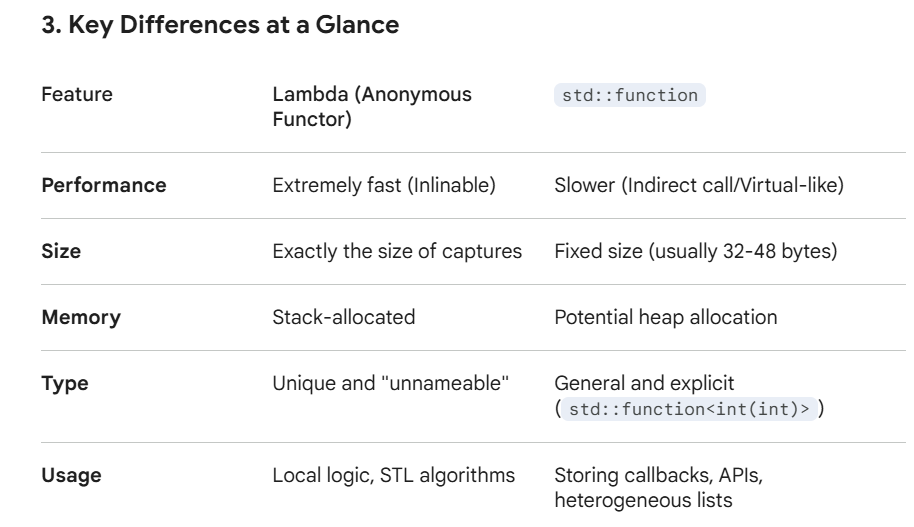

# CPPtricks
## three  scenarios where must use 'this'

## std::function  VS  lambda
### lambda fast:(lambda, the compiler It is writing a unique, unnamed class (a functor))

- Unique Type: Because every lambda has a unique type, the compiler knows exactly which code to execute at compile-time.
- Inlining: Since the compiler sees the definition

### std::function: The Type-Erasure Wrapper
It can store, copy, and invoke any "Callable" (lambdas, function pointers, or member functions) that matches its signature.

### How it works (Type Erasure):
It hides the specific type of the callable behind interface:
- A pointer to the callable object.
- Virtual function calls (or function pointers) to trigger the operator(), copy, and destroy logic.

### The Cost of Flexibility:
+ Indirection: jumping through a pointer. This  prevents the compiler from inlining.
- Memory Allocation: std::function will likely allocate memory on the heap to store data.

----

### Small Object Optimization (SOO)
If your lambda is small , it will store the lambda inside its own internal buffer rather than hitting the heap.

### When to Use Which?
#### Use Lambdas when:
+ pass logics to STL algorithm (e.g., std::sort, std::find_if).
+ Performance is critical (inner loops).
#### Use std::function when:
+ You need to store a callable in a class member or a container (e.g., a std::vector<std::function<void()>> ).
+ The type needs to be explicitly named (e.g., "This function returns a function of type X").